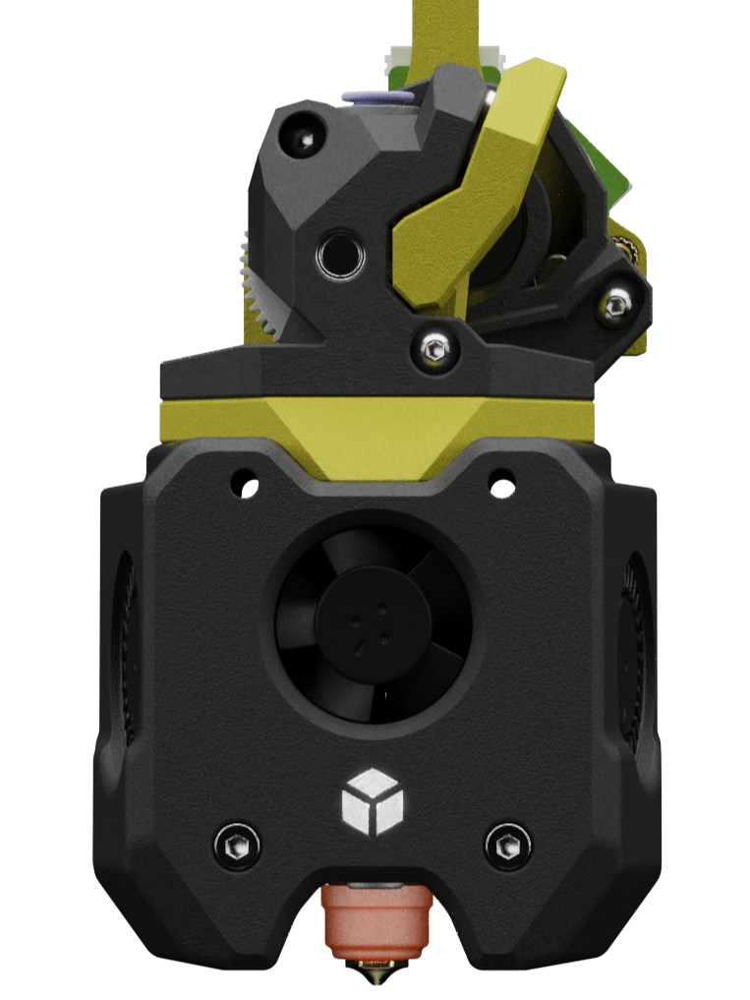
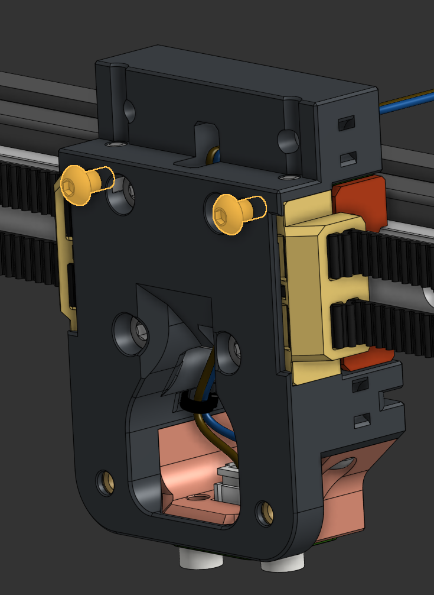
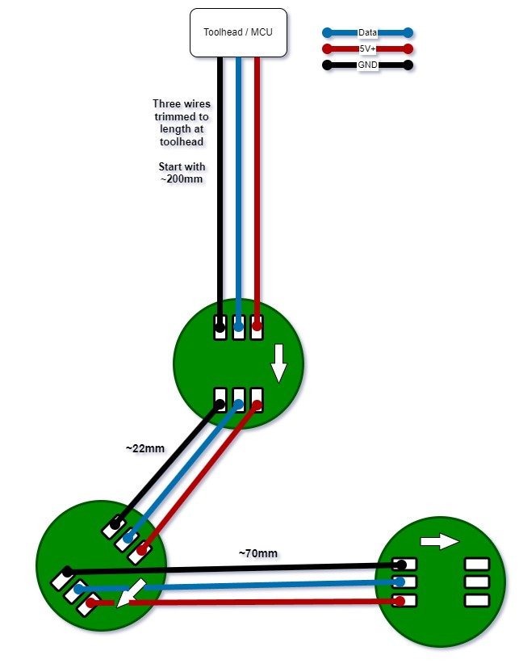
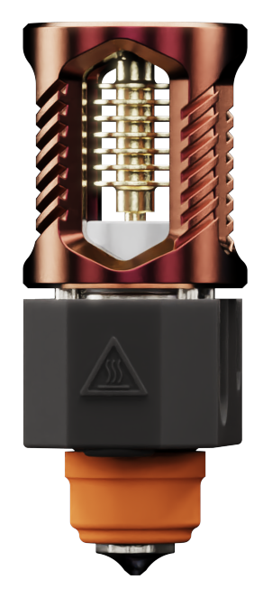
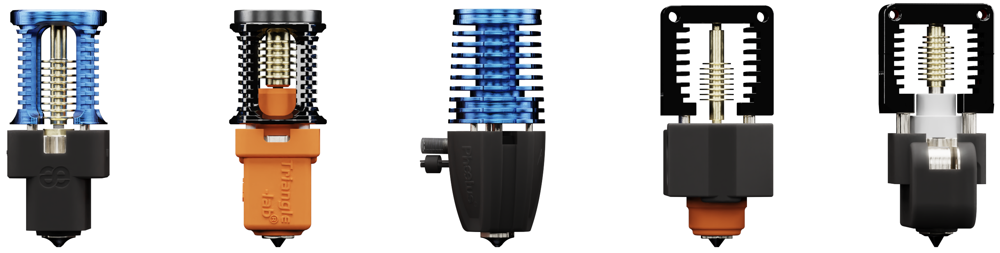

[![CC BY-NC-SA 4.0][cc-by-nc-sa-shield]][cc-by-nc-sa]

# A4T: [A]nother [4]010 [T]oolhead (BETA)

> [!TIP] 
> ### You can help support the development of A4T. 
> Donate at https://ko-fi.com/dwtas 

  
After the last year or two looking after Xol and transforming it into Xol Toolhead, I thought it was about time I tried to see if I could design something from scratch. The result is A4T: [A]nother [4]010 [T]oolhead   

A4T is built around the following constraints:
* Dual 4010 blower fans for part cooling
* HF hotends (designed aroun Dragon HF with an extender, so Rapido HF will also fit).
* 2510 hotend cooling with well-directed hotend cooling airflow. (Can't beet the amazing 5v Delta 2510)
* ***Easy Assembly***
* Custom Wrist Watch BMG mod with Sherpa-Mini spacing. Also works with Sherpa-Mini.
* Neopixel LEDs with good part lighting from in front of the nozzle.
* Built for Xol-Carriage - can work with Voron Tap / Standard Voron CW2 carriage.

## Pre-requisites
A printer that fits either Xol carriage, or a standard voron CW2 or Tap carriage. 
 
To avoid build plate area loss:
- X/Y gantry joints that are within the same size as standard Voron 2.4 or Trident X/Y joints.
- Slimmer than stock idlers (see warning below) 

See Voron Design instructions to install TAP. 
`If using tap, highly recommended to replace M3x50 SHCS with button head screws for better build plate clearance.` 
 
Xol-Carriage documentation is here: https://github.com/Armchair-Heavy-Industries/Xol-Toolhead/blob/main/docs/xol_carriage_assembly.md 

> [!WARNING] Front Idlers  
> A4T can collide with the stock voron front idlers for Trident and 2.4 when the toolhead is in the front corners of the build area. This can cause issues with the homing sequence when homing X if the toolhead is at the front of the gantry on Y.   
> Fully compatible idlers: 
> * clee's [BFI (Beefy Front Idlers)](https://github.com/clee/VoronBFI)   
> * Ramalama2's [Front Idlers](https://github.com/Ramalama2/Voron-2-Mods/tree/main/Front_Idlers)  

## Bill of Materials (BOM)
`*Does not include carriage hardware`
| Qty | Item                                          | Notes                                                                                     |
| --- | --------------------------------------------- | ----------------------------------------------------------------------------------------- |
| 4   | M3 Square Nut (DIN 562)                       | Yes, squre nuts. They don't spin in a slot like hex nuts                                  |
| 3   | M3 x 8 SHCS                                   | 2x Top cowling mounting. 1x Toolhead board mount to back of Xol Carriage                  |
| 2   | M3 x 6 SHCS or BHCS or Waferhead screw        | Any of these three screw heads. The important part is 6mm thread   `This is only for Xol Carriage. If you use Tap or other Voron carriage, you already have SHCS where the hotend adapter slots under`  | 
| 2   | M3 x 50 SHCS                                  | Bottom cowling mounting screws. The same as are in the bottom of Stealthburner            |
| 2   | * M3 x 14 SHCS or BHCS (WWBMG) * M3 x 12 SHCS or BHCS (Sherpa-Mini)                         | Attach extruder to cowling                 |
| 2   | 4010 Blower Fan                               | Recommended blower: GDStime 12,000 RPM 24v. (<a href="https://www.aliexpress.com/item/32798634077.html">Ali Express</a>)                                                        |
| 1   | 2510 Axial Fan                                | Recommended fan: Delta Electronics 15,000 RPM 5v ASB02505SHA-AY6B (<a href="https://www.digikey.com/en/products/detail/delta-electronics/ASB02505SHA-AY6B/7491489">DigiKey</a>) |
| 3   | Neopixel LED PCB                              | The same kind as used in Stealthburner. Get the solder pad version.   `Wiring diagram (click to enlarge) ---->`                        |
| 9   | Lengths of 28 AWG or 26 AWG wire              | To make the LED harness                                                                   |
| 1   | Connector and required crimps                 | To make the LED harness                                                                   |
| 1   | Hotend                                        | Recommended hotend: *  **Dragon HF** with **Triangle Lab ZS-MZE-HF** (<a href="https://www.aliexpress.com/item/1005006402646093.html">Ali Express</a>)   Alternatives:  * Dragon UHF-Mini  * Dragon Ace (with spacer, no MZE) * Rapido HF * NF-Crazy with MZE * NF-Crazy Volcano          |
| 4   | Hotend screws                                 | Should come with your hotend. Dragon/Rapido usually use M2.5 x 8mm SHCS                   |
| 1   | Extruder                                      | Recommended Extruder: * Modified WW-BMG with Bondtech RIDGA v2. ([STLs here](STL))  Alternatives:  *Sherpa-Mini   *VZ-Hextrudort-Low  *LGX-Lite   |
| 2   | M3 threaded heat insert                       | Standard Voron spec: M3 x 5 x 4                                                           |
| 2   | 20mm or 21mm 3mm internal threaded stand off  | To attach toolhead board to the back of the extruder motor and third mounting point on the back of Xol Carriage.  `Length will depend on the motor you use. It needs to line up the toolhead board holder with the back of the Xol Carriage.`                   |

## Printing parts
### Print settings
Parts are meant to be printed in 0.2mm layer heights, 0.25mm first layer should be OK. Other layer heights will cause the built-in supports to fail or fuse to the printed part. 
Print settings will depend on your printer setup / filament used / phase of the moon/etc. 
The parts are not pre-scaled for any particular filamen type. You will need to tune the filament you use for correct shrinkage compensation to get good results. Development was done with multiple brands of ASA and ASA-CF filaments (each individually tuned). 

General voron-like settings are a good starting point for 0.4mm wall widths (four walls, 5 top/bottom layers and 40% infil). 
The print setup was tested with 0.5mm nozzle printing 0.55mm line widths with 3 walls and 40% infill with good results. 

You're printing a toolhead, not a trinket or a toy. You should be aiming for high strength with strong layer adhesion. I.e. print it slower/hotter if you have bad layer adhesion. It doesn't matter if it takes over 2 hours to print the main body. 

## Assembly
### LED Harness (optional)
(click to open full size image) 

### Assembly Steps

| Notes                                                                                                                                                                              | Image |
| ---------------------------------------------------------------------------------------------------------------------------------------------------------------------------------- | ----- |
| Remove the built-in supports from the printed parts                                                                                                                                |       |
| Attach the LED filter to the LED diffuser.  `a drop of superglue is handy here`                                                                                                |       |
| Install the LED filter/diffuser assembly into the cowl  `it should push into place and stay put`                                                                               |       |
| Put the Status LED into the LED carrier  `the one closest to the connector`                                                                                                    |       |
| Install the LED harness into the Cowl                                                                                                                                              |       |
| &nbsp; &nbsp; &nbsp;1. Thread the two nozzle LEDs through the holder part of the cowl from the top and out the bottom                                                              |       |
| &nbsp; &nbsp; &nbsp;2. Install the middle LED of the chain into it's slot                                                                                                          |       |
| &nbsp; &nbsp; &nbsp;3. Put the last LED into the other slot                                                                                                                        |       |
| &nbsp; &nbsp; &nbsp;4. The wires between the 2nd and 3rd LED go back up over the top of the Status LED holder                                                                      |       |
| Put the 2510 HE fan in place.  `It will need to be angled in, slightly top first. The wires should be exiting from the top`                                                    |       |
| Lock the 2510 HE fan in place by sliding the HE fan duct up until the flexture locks. `Careful, don't pinch any wires`                                                             |       |
| Tidy up the LED harness wires in the little hooks. `the left blower fan will lock them in soon`                                                                                    |       |
| Install the 4010 inserts                                                                                                                                                           |       |
| &nbsp; &nbsp; &nbsp;1. take the front cover off the 4010 blower fan `This is easy on gdstime fans. Might not be possible on Delta fans`                                            |       |
| &nbsp; &nbsp; &nbsp;2. Use some superglue or acetone to glue the insert in place `Use the spacer to line it up properly`                                                           |       |
| &nbsp; &nbsp; &nbsp;3. Put the front cover back on the fan                                                                                                                         |       |
| &nbsp; &nbsp; &nbsp;4. Remove the little handle and sand/file the insert flush with the blower opening                                                                             |       |
| Time to put the blower fans in `Slide them into each side with the opening at the bottom`                                                                                          |       |
| Attach your hotend                                                                                                                                                                 |       |
| Put all the square nuts in their places for later                                                                                                                                  |       |
| &nbsp; &nbsp; &nbsp;* Two under the extruder mounting points                                                                                                                       |       |
| &nbsp; &nbsp; &nbsp;* Two in the back behind the exturder `Xol-Carriage only`                                                                                                      |       |
| ***Main cowl is ready, time for the extruder***                                                                                                                                    |       |
| Make sure you used long enough screws to hold your stepper motor to the extruder and install the 20mm standoffs behind the motor                                                   |       |
| Attach the toolhead board mount and toolhead board to the standoffs `THB mounts, except for Sherpa-Mini, need 2x M3 heatsets installed before this step`                           |       |
| Put the Extruder Adapter in place on top of the cowl `Not used for Sherpa-Mini`                                                                                                    |       |
| ℹ️ **Clockwork2 carriage/Tap users**: Don't forget the 2x M3x8 SHCS that go behind the adapter                                                                                      |       |
| Attach the extruder to the main cowl                                                                                                                                               |       |
| Time to wire it all up                                                                                                                                                             |       |
| &nbsp; &nbsp; &nbsp;Make sure to keep wires out of the carriage screw keep clear zone                                                                                              |       |
| &nbsp; &nbsp; &nbsp;Use the cable tie slots to keep everything tidy                                                                                                                |       |
| Finaly, we can put this thing on the printer!                                                                                                                                      |       |
| &nbsp; &nbsp; &nbsp;Make sure that the screws that are already in the carriage have a bit over 3mm of exposed thread `If they don't, the toolhead wont be able to slot into place` |       |
| &nbsp; &nbsp; &nbsp;Put the third toolhead board mounting screw into the back of Xol carriage, leaving 4 to 5mm of exposed threads                                                 |       |
| Hook the toolhead board mount over third mounting screw and slide the completed toolhead down onto the screws that are pre-placed in the carriage.                                 |       |
| Tighten up all the screws: * 2x M3x50 bottom screws * 2x screws that were already in the carriage `access via the driver holes` * 2x M3x8 top screws ** From the front for CW2/Tap ** From the back for Xol Carriage * 1x M3x8 under the toolhead board (Xol Carriage only)                                                                                                                                                         |       |
| Remember to hook up your probe wires from the carriage to the toolhead board, if you're using one.  `and your endstop wires if you haven't figured out sensorless yet`              |       |
| Make sure you double check your software setup `especially endstop location`                                                                                                       |       |
> [!WARNING] 
> Blower fan fit
> `If your blower fans are not a snug fit, you likely had shrinkage compensation or EM issues. You can probably get away with using some masking tape on top of a loose fan in a pinch to save a reprint.`

 

### Enjoy using A4T
This work is licensed under a
[Creative Commons Attribution-NonCommercial-ShareAlike 4.0 International License][cc-by-nc-sa].

[![CC BY-NC-SA 4.0][cc-by-nc-sa-image]][cc-by-nc-sa]

[cc-by-nc-sa]: http://creativecommons.org/licenses/by-nc-sa/4.0/
[cc-by-nc-sa-image]: https://licensebuttons.net/l/by-nc-sa/4.0/88x31.png
[cc-by-nc-sa-shield]: https://img.shields.io/badge/License-CC%20BY--NC--SA%204.0-lightgrey.svg
